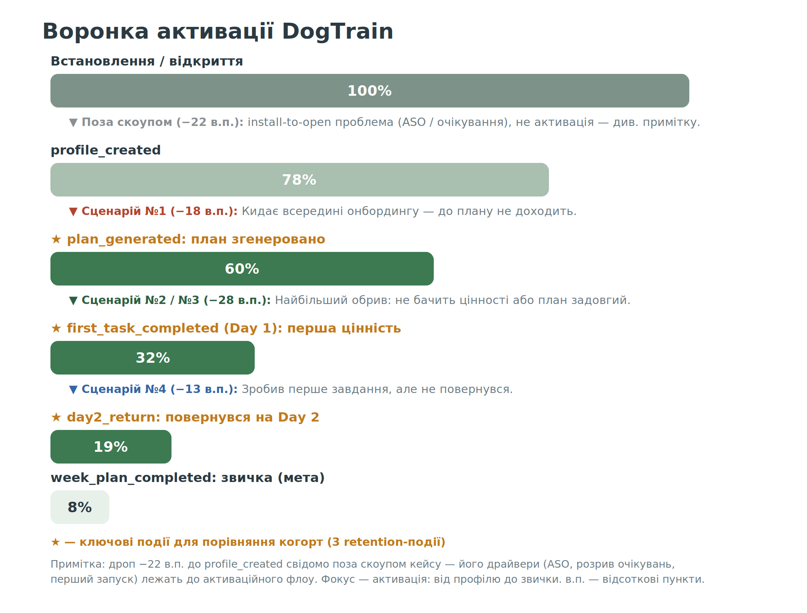
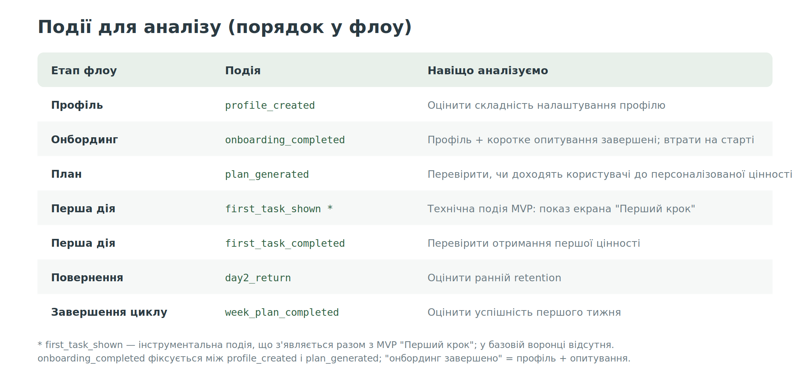
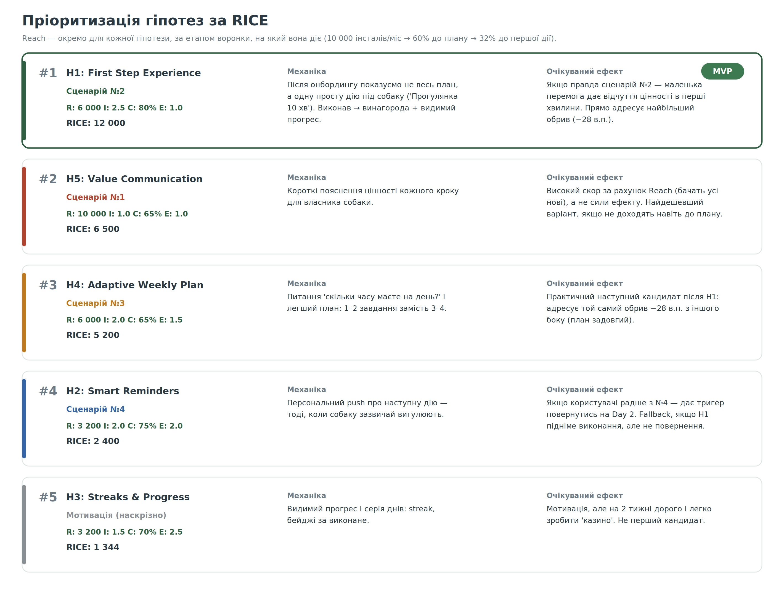
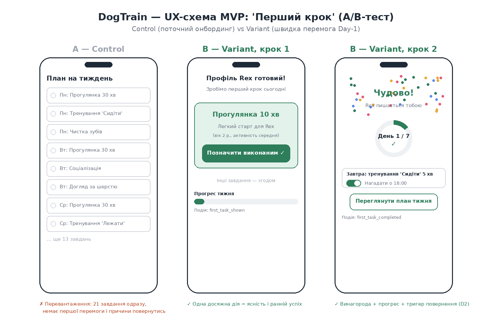
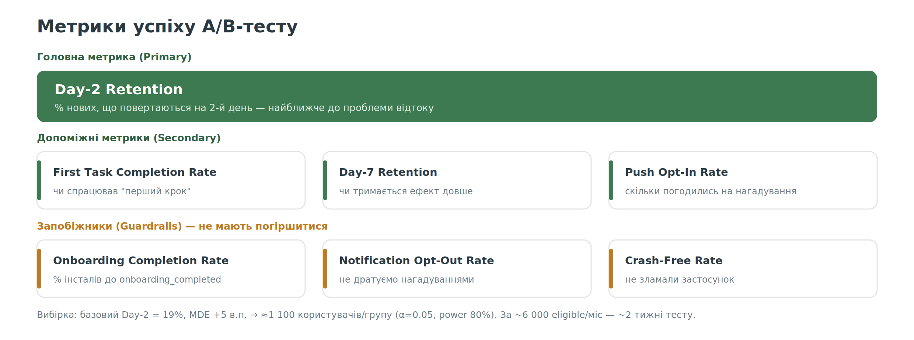

# 🎯 Аналіз проблеми відтоку користувачів мобільного застосунку DogTrain

За умовою кейсу понад 80% нових користувачів припиняють користуватись застосунком на Day 2–3 та не завершують перший тижневий план.

---

## 1. Воронка як робоча модель

Використовую воронку для локалізації причини відтоку. Подальші гіпотези прив'язані до конкретних етапів цієї воронки.

Для порівняння когорт користувачів, які залишилися в продукті та які пішли, я обрала 3 основні події:

- **plan_generated** (% користувачів, яким згенеровано перший план);
- **first_task_completed** (% користувачів, які виконали перше завдання);
- **day2_return** (% користувачів, які повернулися на Day 2).

**Скоуп.** Дроп −22 в.п. (встановлення → profile_created) свідомо залишаю поза межами кейсу: його драйвери — install-to-open проблеми (ASO, розрив очікувань, перший запуск) — лежать до активаційного флоу. Фокус кейсу — активація: від профілю до звички.

*в.п. — відсоткові пункти.*

### Події для аналізу

**Визначення onboarding_completed:** профіль + коротке опитування завершені. Подія фіксується між profile_created і plan_generated. first_task_shown — інструментальна подія, що з'являється разом з MVP.

---

## 2–3. Пріоритизація гіпотез за RICE

За фреймворком **RICE** роблю вибір першої гіпотези для перевірки. Решта гіпотез залишаються в беклозі та можуть бути переглянуті після отримання результатів MVP.

**Методологія Reach.** Реальних даних про трафік у кейсі немає, тому припускаю 10 000 нових інсталів на місяць. Reach рахую окремо для кожної гіпотези — за етапом воронки, на який вона діє:

- гіпотези в онбордингу (H5) — 10 000 (бачать усі нові користувачі);
- гіпотези після генерації плану (H1, H4) — 6 000 (60% доходять до плану);
- гіпотези після першої дії (H2, H3) — 3 200 (32% виконують перше завдання).

Однаковий Reach для всіх гіпотез зробив би його недискримінуючим фактором.

**Причина вибору H1:** найвищий RICE-скор (12 000), найменший обсяг робіт, швидка перевірка та прямий вплив на найбільший обрив воронки (−28 в.п. між планом і першою дією).

**Чому Confidence 80% для гіпотези H1:**
80% означає: досить впевнена, щоб тестувати цю гіпотезу першою. H1 перевіряє моє основне припущення: користувачі не отримують цінність достатньо швидко. Я вважаю цей сценарій найбільш імовірним, але через відсутність реальних даних не можу бути впевненою повністю.

**Про H5 на #2:** високий скор — за рахунок Reach (бачать усі нові користувачі), а не сили ефекту (Impact 1.0). RICE — інструмент пріоритизації, не істина: практичним наступним кандидатом після H1 вважаю H4 — вона адресує той самий обрив −28 в.п. з іншого боку (план задовгий).

**Найбільший ризик:** проблема знаходиться не в активації, а в ранньому retention. У такому випадку більш ефективною буде H2 (Smart Reminders). Саме тому H1 перевіряється через MVP та A/B-тест.

---

## Гіпотези детально

### H1. First Step Experience (#1, MVP)
**Як допоможе:** закриває сценарій №2 — користувач пройшов онбординг, але не відчув цінності. Даємо одну просту дію замість цілого тижневого плану, щоб швидко створити відчуття прогресу.
**Реалізація:** після завершення онбордингу показуємо одне персоналізоване стартове завдання → після виконання показуємо прогрес та пропонуємо нагадування.
**Перевірка:** A/B-тест. Control — поточний сценарій, Variant — екран "Перший крок". Метрики: First Task Completion Rate, Day-2 Retention.

### H5. Value Communication (#2)
**Як допоможе:** закриває сценарій №1 — користувач не бачить цінності ще під час онбордингу. Пояснення користі підвищують мотивацію завершити налаштування.
**Реалізація:** додаємо короткі підказки "Навіщо це потрібно вашому собаці?" у ключових кроках онбордингу.
**Перевірка:** A/B-тест. Метрики: Onboarding Completion Rate, кількість сесій.

### H4. Adaptive Weekly Plan (#3)
**Як допоможе:** закриває сценарій №3 — користувач бачить цінність, але план здається занадто складним. Менший обсяг завдань знижує бар'єр входу.
**Реалізація:** додаємо питання про доступний час і генеруємо легший або стандартний план.
**Перевірка:** A/B-тест. Метрики: Plan Completion Rate, Day-2/Day-7 Retention.

### H2. Smart Reminders (#4)
**Як допоможе:** закриває сценарій №4 — користувач виконав першу дію, але не повернувся. Персональні нагадування створюють тригер для повторного відкриття застосунку.
**Реалізація:** після виконання завдання пропонуємо push-нагадування на наступну активність.
**Перевірка:** A/B-тест. Метрики: Push CTR, Day-2/Day-3 Retention, Opt-Out Rate.

### H3. Streaks & Progress (#5)
**Як допоможе:** наскрізна мотивація — видимий прогрес і серія днів (streak, бейджі).
**Чому не зараз:** на 2 тижні дорого, легко скотитись у "казино"-механіку. Повертаюсь після результатів MVP.

---

# 🛠 План дій для команди

## 1. Гіпотеза (user story)

> **Як** новий власник собаки, який щойно створив профіль улюбленця,
> **я хочу** одразу зробити одну просту дію й побачити прогрес,
> **щоб** відчути ранній успіх і мати причину повернутись завтра.

**Приклад:** "Прогуляйтеся із собакою 10 хвилин і відмітьте виконання."

Після завершення:
- прогрес "День 1/7";
- позитивне підкріплення;
- пропозиція увімкнути нагадування на наступний день.

**Мета MVP** — максимально швидко перевірити, чи впливає рання цінність на Day-2 Retention.

## 2. Зміни в інтерфейсі

**Control** — поточний онбординг (весь план одразу, 21 завдання).
**Variant** — екран "Перший крок" → виконання → святкування з прогресом і opt-in'ом на нагадування.
Це зменшує когнітивне навантаження та фокусує користувача на одній дії.

## 3. Логіка реалізації

1. Користувач завершує профіль і коротке опитування → подія **onboarding_completed**.
2. Система за простими правилами (без ML) обирає **одне** стартове завдання з каталогу. Напр.: активність low → "прогулянка 10 хв"; вік < 12 міс → "команда 'Сидіти' 5 хв"; інакше — дефолт. Логіка легко змінюється без складної розробки.
3. Показуємо екран "Перший крок" → подія **first_task_shown**.
4. Тап "Позначити виконаним" → **first_task_completed** → екран святкування: анімація + прогрес "День 1/7" + opt-in "Нагадати завтра о 18:00".
5. За opt-in'ом плануємо локальний push на Day 2; далі відкриваємо наявний екран тижневого плану (план генерується в обох когортах — Variant лише змінює порядок показу).
6. A/B-тест: 50/50 за user_id, контроль бачить поточний флоу; усі події з feature-flag `cohort=control|variant`.

## 4. Метрики успіху

**Розмір вибірки:** базовий Day-2 Retention = 19%, мінімальний детектований ефект (MDE) +5 в.п. → ≈1 100 користувачів на групу (α = 0.05, power 80%). За ~6 000 eligible-користувачів/міс (доходять до onboarding_completed) — приблизно 2 тижні тесту з запасом.

**Корисний нюанс:** якщо Day-2 не зрушить, а First Task Completion Rate зросте — це теж сигнал: перемога є, а тригера повернутись бракує. Тоді наступний крок — H2.

## 5. Acceptance criteria

- Variant-користувач після онбордингу бачить екран "Перший крок" рівно з одним завданням, вибраним за правилами під профіль.
- Control-користувач бачить поточний онбординг без змін.
- Когорта стабільна (sticky) per user_id, 50/50, без перетікання між сесіями.
- Події onboarding_completed, first_task_shown, first_task_completed, day2_return логуються з cohort feature-flag та доступні в аналітиці.
- Тап "Позначити виконаним" фіксує завдання й показує святкування з коректним прогресом "День 1/7".
- Opt-in планує push на Day 2; при відмові push не надсилається.
- Падіння не зростають; екрани коректні на iOS і Android, у т.ч. на малих екранах.
- Є feature flag, щоб вимкнути варіант без релізу.

## 6. To-Do list для команди (5 ролей, 2 тижні)

| Роль | Тиждень 1 | Тиждень 2 |
|---|---|---|
| **Dev 1 (front-end)** | Зверстати екрани First Step і Success Screen під iOS та Android за макетами. | Підключити A/B-тест через feature-flag (половина нових бачить варіант) і допиляти за фідбеком QA. |
| **Dev 2 (backend)** | Зробити логіку вибору першого завдання (таблиця правил) і налаштувати події аналітики. | Додати push-нагадування на Day 2 і стабілізувати — щоб варіант можна було швидко вимкнути. |
| **Дизайнер (part-time)** | Фіналізувати макети трьох екранів і віддати специфікацію розробникам. | Дописати тексти й анімацію успіху, переглянути готову реалізацію проти макета. |
| **Аналітик (part-time)** | Описати події для аналітики й підтвердити розрахунок вибірки: ≈1 100/групу, ~2 тижні. | Зібрати дашборд A/B-тесту й переконатися, що події пишуться коректно. |
| **PM** | Зафіксувати скоуп і пріоритети MVP, узгодити з командою та стейкхолдерами критерії готовності. | Запустити експеримент 50/50, щодня стежити за guardrails і ухвалити рішення go / no-go. |
